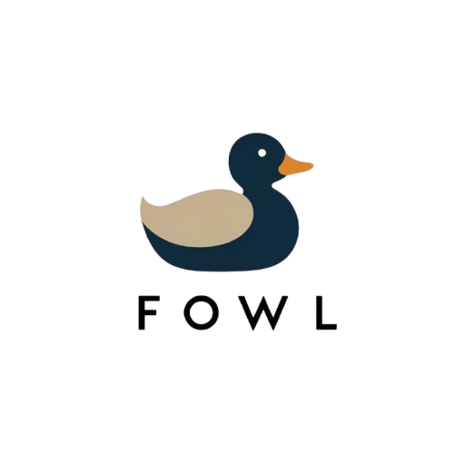

# The Fowl Programming Language

Fowl is a programming language that aims to restrict the use of as many
code constructs as possible that are prone to leading into code smells.

## Focus

Fowl is heavily opinionated and purposely does not provide a rich builtin set. It
is not focused on performance or giving programmers the freedom to do things their
own way. Instead it attempts to impose a uniform way of doing things, so that
reading any code written in Fowl is easily understood.

Fowl's primary aims are to

1. Eradicate dead code
2. Discourage large functions
3. Break up complexity
4. Ensure the code is stable
5. Ensure the code is tested

## Inspiration

Fowl is heavily inspired by the work done on the field of refactoring by
Martin Fowler, from whom the language's name is inspired.

## Manifesto

1. These things don't exist

    - Comments
    - Switch statement
    - Ternary operator
    - Global variables

2. Single statement per line, multiple lines per statement

3. All variables and functions declared must be used

4. The cyclomatic complexity of a function must not exceed 10

5. All errors must be handled, unless excplicitly declaring otherwise

6. Every function is accompanied by at least one test, unless explicitly declaring otherwise

7. Variable/function names 

    - cannot be shorter than 3 letters
    - cannot start with 'my' or 'test'
    - cannot end with a number or 'new'
    - cannot contain '-' or '_'